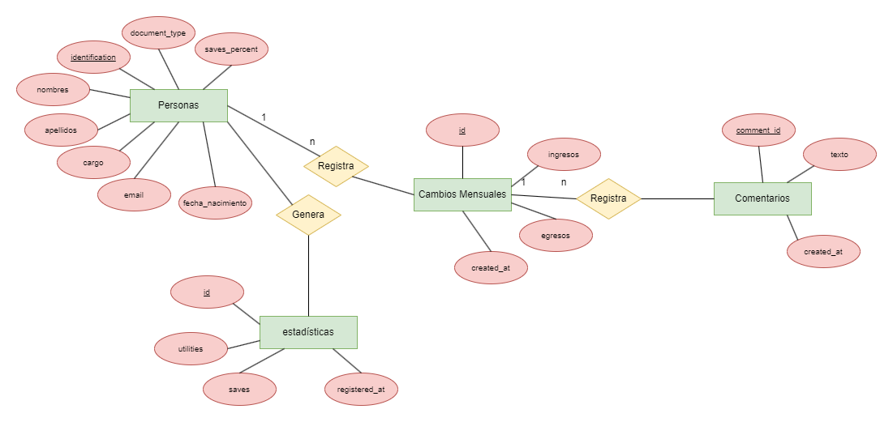
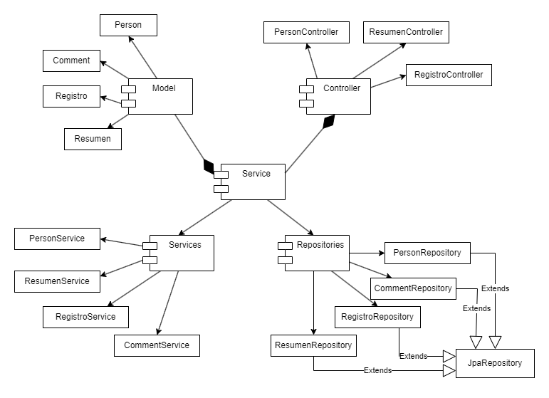

# proyecto-final-springjs
Este proyecto se basa en una aplicación donde se usan los servicios API REST que pueden ser creados por medio del framework de Spring. Un framework basado en Java.

Este proyecto tiene en cuenta las siguientes dependencias.
* Spring Boot Devtools
* Spring Web
* Lombok
* Spring Data JPA
* JDBC Driver
* MySQL Driver

# Descripción del proyecto
El proyecto se basa en una plataforma de asesoriamiento financiero. Según la descripción del proyecto, esta herramienta debe de dar una orientación financiera personalizada a los usuarios. Esto se va a basar en el ofrecimiento de herramientas, seguimiento de gastos, planificación de inversiones y gestión de deudas.

## Herramientas Utilizadas
Las herramientas que han sido utilizadas en la realización del proyecto son las siguientes:
* Spring Framework: Framework basado en Java para la creación de API Rest.
* Javascript: Lenguaje de programación utilizado para mostrar datos en un sitio web.
* IntelliJ IDEA: IDE usado para el proyecto de Spring.
* Postman: Aplicación usada para testear los endpoints.
* MySQL Workbench: Herramienta visual para visualizar y manejar datos del SGBD MySQL.

## Requerimientos Funcionales
* Realizar un CRUD de las personas junto con una contraseña para permitir subir la información.
* Crear una sección que permita a partir de los ingresos y egresos poner comentarios dentro de cada mes para definir por qué aumentó o disminuyeron los ingresos.
* Mantener un saldo actualizado en la base de datos donde se tengan los ahorros.


## Base de datos
La base de datos va a estar formada a partir de 4 entidades. Estas entidades son las siguientes:

* Personas: 
    * **Descripción:** Tabla usada para guardar la información básica de la persona. Esta información contiene los siguientes atributos:

        * ***Document_Type:*** [VARCHAR(8)]: Tipo de identificación de la persona.
        * ***Identificación*** [PK; Integer]: Identificación de la persona.
        * ***Nombres***: [VARCHAR(100)]: Nombres de la persona.
        * ***Apellidos***: [VARCHAR(100)]: Apellidos de la persona.
        * ***Cargos***: [VARCHAR(100)]: Tipo de cargo o empleo que tiene la persona.
        * ***Fecha de Nacimiento***: [DATE]: Fecha de nacimiento de la persona.
        * ***email:*** Correo electrónico de la persona registrada.
        * ***saves_percent:*** Porcentaje que la persona debe de tener para ahorros.

* Cambios Mensuales:
    * **Descripción:** Esta tabla se va a encargar de guardar un historial de los ingresos y egresos que la persona ha tenido por mes. Los atributos son los que se presentan a continuación.

        * ***change_id:*** [PK, Integer, autoincrement] Identificación del cambio mensual.
        * ***Identificación:*** [FK, Integer] Identificación de la persona a la que pertenece este registro.
        * ***ingresos:*** [Double] Ingresos mensuales de la persona.
        * ***egresos:*** [Double] Egresos mensuales de la persona.
        * ***created_at***: Fecha de creación del registro. Permite saber en que mes ha sido agregado el registro.

* Comentarios:

    * **Descripción**: Tabla que permite agregar comentarios por cada registro de cambios de ingresos por persona. Esta tabla mantiene todos los comentarios que se tengan sobre el por qué tiene ingresos más altos por ejemplo o gastos más elevados. Los atributos en esta tabla son los siguientes:

        * ***comment_id:*** [PK, Integer, Autoincrement] Identificación del comentario creado.

        * ***register_id:*** [FK, Integer] Identificación del registro de la persona.

        * ***created_at:*** [DATE] Fecha donde se crea el comentario.

* Estadísticas.
    * **Descripción:** Esta tabla guarda la utilidad y el dinero que se tiene libre mes tras mes en formato de saldo. Contiene los siguientes atributos:

        * ***id_statistics:*** [PK, Integer, Autoincrement]Identificación de las estadísticas.
        * ***person_id:*** [FK, Integer] Identificación de la persona que tiene los ingresos.
        * ***utilities:*** [Double]
        Utilidades que tienen las personas en formato numérico ($).
        * ***saves:*** [Double] Ahorros que la persona debería de tener en el mes.
        * ***month:*** [Date] Mes en el que se realiza el ahorro.

### MER
El diagrama Entidad Relación de la base de datos es la siguiente.


### Diagrama UML
El diagrama UML que se presenta a continuación es una organización gráfica simplificada del proyecto.

## Endpoints
El proyecto está configurado para que la ruta principal sea
 ```http://localhost:9090/api```

Las rutas que le siguen por entidad son las siguientes:

* **Persona:** ```/person-data```
    * ***Peticiones:*** POST, GET, PUT
* **Registros:** ```/person-data/records```
    * ***Peticiones:*** POST, GET
* **Comments:** ```/person-data/records/{id}/comments```
    * ***Peticiones:*** POST, GET

Visto de otra manera, las rutas obtenidas por los controladores junto con su tipo de petición son las siguientes:

```http://localhost:9090/api/person-data```
    |_ ***Personas***
      |_ ```/{id}``` (GET): Obtiene la información de una persona en específico.
      |_```/create```(POST): Crea una instancia en la base de datos de una persona.
      |_```/actualizar/{id}``` (PUT): Actualiza la información de una persona a partir de la identificación y de la información guardada en el cuerpo JSON.
    |_ ***Register*** -> Registro de ingresos y egresos del día.
      |_```/{id}/newRecord``` (POST): Creación de un nuevo registro de ingresos y egresos de la persona buscada.
      |_```/records/{id}``` (GET): Obtiene la información de un registro en específico.
    |_***Comentarios***
      |_```/{recordId}/create``` (POST): Publica la información de un comentario de un registro en específico.

### **OBSERVACIONES A TENER EN CUENTA DENTRO DE LA API REST**
    > Se omiten algunos endpoints dado a la naturaleza de las entidades. Por ejemplo, la entidad Resumen no cuenta con una publicación ni actualización de ahorros debido a que estos se generan de manera automática en la base de datos.

    > No se eliminan registros debido a que se busca mantener un historial de los registros.

    > Debido a las anotaciones @OneToMany como @ManyToOne, la información se mantiene dentro de algún elemento padre (ejemplo: Las estadísticas pueden ser tomadas directamente desde la persona).

## Razones de por qué funciona el proyecto sin necesidad de hacer uso de un framework para el front.
Javascript maneja funciones como fetch para obtener información externa. Al momento de buscar el link de nuestra API para saber la información, esta se obtiene por medio de promesas.
Sin embargo, hay que tener en cuenta la anotación @CrossOrigin. Esta anotación brinda soporte del CORS haciendo que se puedan transferir los datos sin ningún problema.
